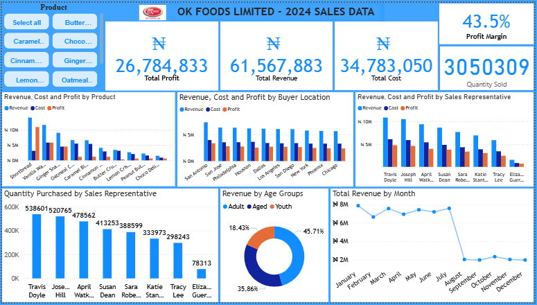
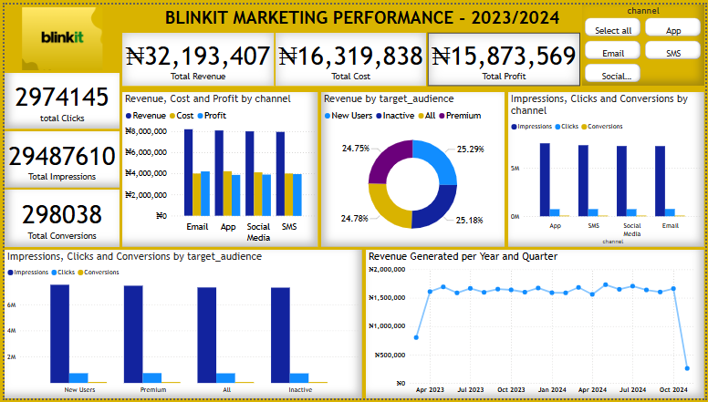
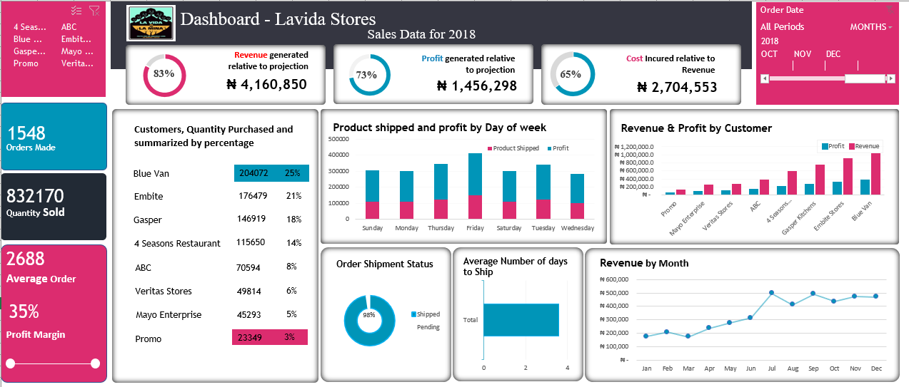
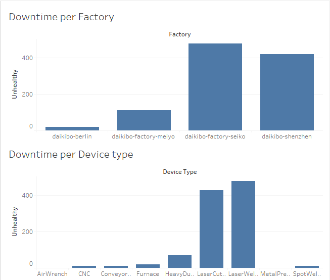

# ABOUT ME

Hello! I am Ogubuike Wilson Chukwuemena😎, a detail oriented data analyst, dedicated to transforming raw data into meaningful insights. I specialise in helping organizations and businesses make informed decisions by transforming complex data into actionable insight. With Excel, Power BI, Tableau and SQL, I leverage advanced data analysis and visualization techniques to uncover trends, Identify areas for improvement and drive business growth.

# SKILLS

1. Proficient in data cleaning, processing, exploratory data analysis (EDA) and modelling using Excel, Power BI, SQL.
2. Experience in building/creating databases, tables and analysing data using SQL.
3. Experience in building interactive dashboards and reports using Excel, Power BI and Tableau. 
4. Excellent communication and data storytelling skills and ability to translate complex data insights into actionable recommendations.

# My Projects

Below are some of the projects I have worked on.

## OK Foods Sales Performance Analysis for the year 2024

OK Foods is a sales store that sells snacks (biscuits and confectionery products). The purpose of this analysis was to monitor key performance indicators, get more insights on the company's sales performance, performance of their sales representatives, find out products that customers purchase more and generates more profit, and equally suggest areas for improvement. The project analysis was carried out using Excel and Power BI tools.
[Read More](OK_Foods_Analysis_Report.pdf)

## Blinkit's Marketing Performance Analysis

Blinkit is an online marketing company that generates revenue through impressions and clicks on campaigns/posts they make through channels like Email, Apps, SMS and Social Media. The analysis seeks to investigate their marketing performance for the period of March, 2023 to November, 2024, monitor Key performance indicators, find out best performing channel by revenue/profit, and give actionable insights on areas for improvement. The project analysis was carried out using Excel and Power BI tools.
[Read More](Blinkit_Marketing_Perfomance_Analysis_Report.pdf)

## Analysis of Lavida Stores Sales Performance for the year 2018

Lavida stores is a sales and delivery store that is into sales and shipment of cookies to their customers. The analysis aims to find out the ratio of revenue and profit generated relative to projection, the percentage of revenue that was used for promo, customers with the most quantity purchased and the average number of days it takes to ship products to their customers, and make actionable suggestions for improvement. The project analysis was carried out using Excel tool.
[Read More](Lavida_Store_Sales_Analysis_Report.pdf)

## Daikibo Factories’ Telemetry Data Analysis

Daikibo is a production company and a client of Deliotte, having four (4) different factories located in: Meiyo (Tokyo, Japan), Seiko (Osaka, Japan), Berlin (Berlin, Germany) and Shenzhen (Shenzhen, China). Each location has nine (9) types of machines, sending a message every 10 mins and this data has been collected for one month. The reason for collecting this telemetry data and the analysis was to identify which location machines broke down the most, and the machines that broke down most often in that location. I was opportuned to carry out this project analysis as a data analyst intern with Deloitte. The project analysis was carried out using Tableau. [View Certificate](My_Deloitte_Internship_Certificate.png)
[Read More](Daikibo_Telemetary_Data_Analysis_Report.pdf)

## Below are few codes from projects I did using SQL
- select sum(Artist_Label_address)
- from Artist;

- ALTER TABLE Artist 
- ADD Artist_Label_address int Not Null DEFAULT "11";

- update Artist
- SET Artist_Label_address =12
- where Artist_ID =2;

- select* from foreigners.Artist
- where Artist_name like "A%";

- select*
- from Artist
- inner join City
- on Artist.City_ID=City.City_ID;

# Contact Me

|----------|----------|
| 📩   |   [your_email@gmail.com](wilsonemena@gmail.com)	     |
| 📞   |   [2348105370236](https://wa.me/+2348105370236)       |	
| 🗃️   |   [View Resume](OGUBUIKE_WILSON_DA_CV.pdf)	 	       |
